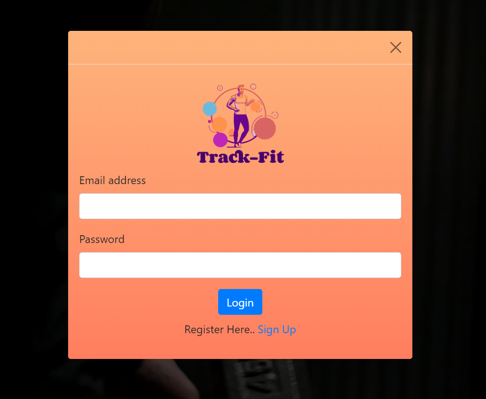
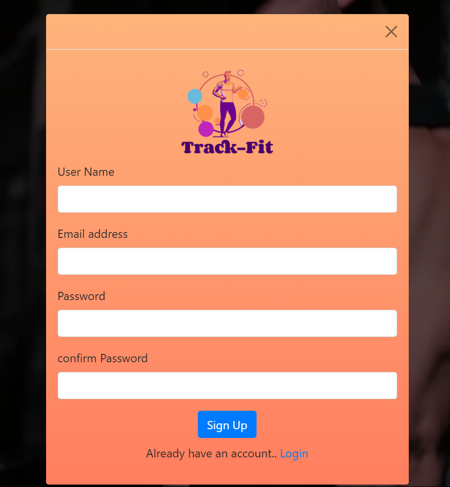
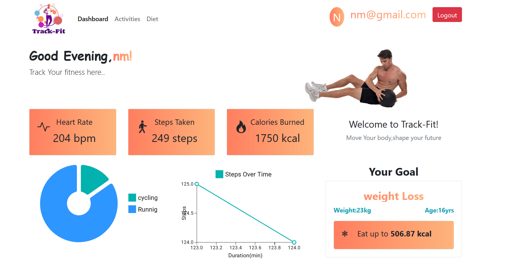
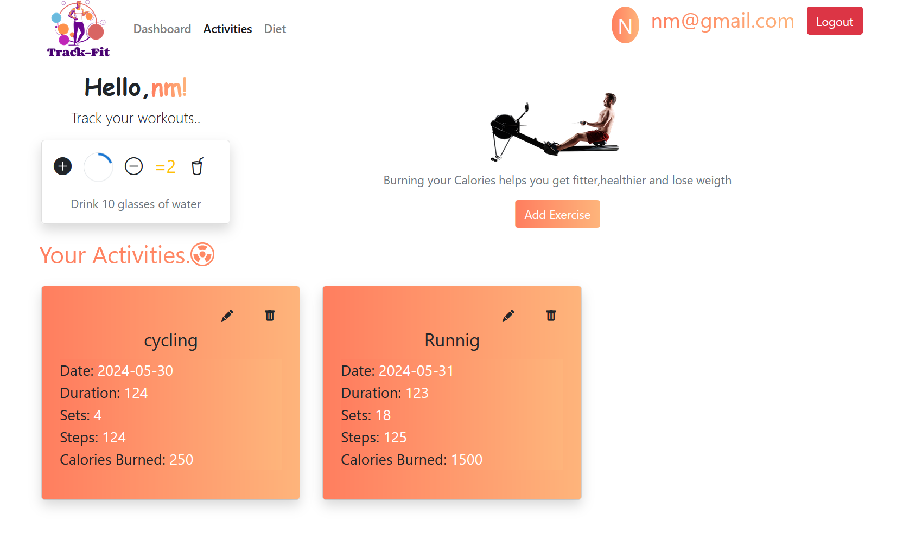
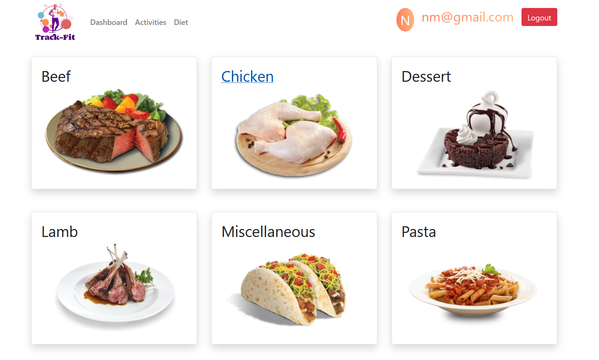

# Fitness App

The Fitness App is a comprehensive application designed to help users track their fitness goals, monitor daily activities, and maintain a healthy lifestyle. It provides features such as heart rate monitoring, step tracking, calorie counting, and workout analysis.

## Features

- **User Authentication:** Secure login and registration for users.
- **Dashboard:** Overview of daily fitness stats, including heart rate, steps taken, and calories burned.
- **Goals:** Set and track personal fitness goals.
- **Workouts:** Log workouts and view detailed statistics.
- **Charts:** Visual representation of fitness data using pie and line charts.

## Technologies Used

- **Frontend:** React, Redux, Bootstrap
- **Backend:** Node.js, Express
- **Database:** MongoDB
- **APIs:** Custom APIs for user data, goals, and workouts
- **Authentication:** JWT (JSON Web Tokens)
- **Charts:** Chart.js

Make sure you have the following installed:

- Node.js (v14.x or later)
- npm (v6.x or later)
- MongoDB (local or cloud instance)

### Installation

1. **Clone the repository:**

   ```bash
   git clone https://github.com/manumn95/Track_Fit.git
   ```
   ```bash
   git clone https://github.com/manumn95/Track-Fit-Backend.git
   ```
## Live:''

## Screenshots

**Authentication-page**


  

**Landing-page**


**Dashboard**


**Activities**


**Diet**


**Find-Recipes**

